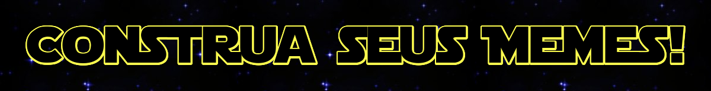
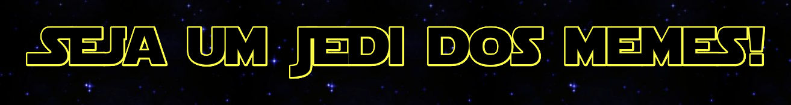

### Aula 4: Memes!

* Inicie a aula mostrando que além de memes estáticos, o Scratch permite colocar interatividade e movimento (tente 'Corinthians'):

<iframe allowtransparency="true" width="485" height="402" src="//scratch.mit.edu/projects/embed/247796090/?autostart=false" frameborder="0" allowfullscreen></iframe>
    
* Agora, peça para que os alunos tenham suas idéias de meme com interação e movimento (como um gif).

* Para produzir as imagens, com texto, basta utilizar os recursos do site [Meme Generator](https://imgflip.com/memegenerator/Y-U-No)

* Caso o aluno queira mais personalização, o texto pode ser feito em diversas fontes no [Font Meme:](https://fontmeme.com/the-electric-company-font/)

* Agora é deixar rolar e ajudá-los na construção da lógica dos movimentos do Scratch!

* Não se esqueça de compartilhar os projetos no Facebook!

[voltar](./)